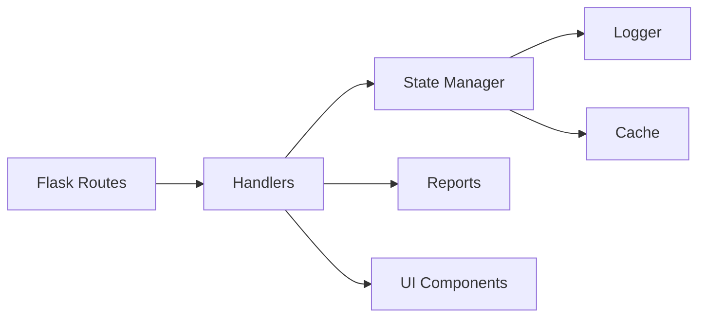

# Strike Console Refactor — Design

## Architecture Overview

```
strike/dashboard/
├── strike_console.py        # Thin entry point (~800 LOC)
├── ui/
│   ├── __init__.py
│   ├── components.py        # HTML generators (~600 LOC)
│   └── themes.py            # Color schemes (~200 LOC)
├── handlers/
│   ├── __init__.py
│   ├── attack_handler.py    # Attack execution (~800 LOC)
│   ├── hydra_handler.py     # HYDRA attacks (~500 LOC)
│   └── session_handler.py   # Session mgmt (~300 LOC)
├── state/
│   ├── __init__.py
│   ├── manager.py           # Global state (~300 LOC)
│   ├── cache.py             # ReconCache (~200 LOC)
│   └── logger.py            # AttackLogger (~200 LOC)
└── reports/
    ├── __init__.py
    ├── generator.py         # Report generation (~400 LOC)
    └── templates.py         # HTML templates (~200 LOC)
```

## Current Analysis

| Компонент | Строки | Назначение |
|-----------|--------|------------|
| Imports | 1-130 | Dependencies |
| AttackLogger | 153-212 | File logging → `state/logger.py` |
| ReconCache | 223-258 | Cache management → `state/cache.py` |
| Attack logic | 259-1556 | Core logic → `handlers/attack_handler.py` |
| Flask routes | 1557-1733 | Endpoints → keep in console |
| HYDRA | 1736-1993 | Hydra attacks → `handlers/hydra_handler.py` |
| Report generation | 1624-1709 | Reports → `reports/generator.py` |
| Remaining | 1993-4247 | Split by function |

## Data Flow



## Migration Strategy

### Phase 1: Extract State (No API changes)
1. Create `state/` package
2. Move AttackLogger → `state/logger.py`
3. Move ReconCache → `state/cache.py`
4. Create StateManager → `state/manager.py`
5. Update imports in strike_console.py

### Phase 2: Extract Handlers
1. Create `handlers/` package
2. Extract attack execution logic
3. Extract HYDRA logic
4. Update Flask routes to use handlers

### Phase 3: Extract UI
1. Create `ui/` package
2. Extract HTML generators
3. Extract theme configuration

### Phase 4: Extract Reports
1. Create `reports/` package
2. Move report generation
3. Add templates

### Phase 5: Cleanup
1. Remove dead code
2. Final strike_console.py < 30KB
3. Add __all__ exports

## Backwards Compatibility

```python
# strike_console.py will re-export for compatibility:
from strike.dashboard.state.logger import AttackLogger
from strike.dashboard.state.cache import ReconCache
from strike.dashboard.handlers.attack_handler import run_attack

# Existing code continues to work:
from strike.dashboard.strike_console import AttackLogger  # OK
```

## Verification

1. Все Flask endpoints работают:
   - GET /
   - POST /start-attack
   - POST /stop-attack
   - GET /attack-stream
   - POST /generate-report

2. Unit tests для каждого модуля

3. Integration test: full attack flow

---

**Created:** 2026-01-09
