<p align="center">
  
</p>

<h1 align="center">SENTINEL - AI Security Platform</h1>

<p align="center">
  <strong> Defense +  Offense +  Framework - Complete AI Security Suite</strong><br>
  <strong>Dragon v4.1 * January 2026</strong>
</p>

<p align="center">
  
  
  
  
</p>

<p align="center">
  <a href="https://github.com/DmitrL-dev/AISecurity/actions"></a>
  <a href="https://pypi.org/project/sentinel-llm-security/"></a>
  <a href="./LICENSE"></a>
  <a href="./docs/academy/beginners/en/"></a>
</p>

---

> [!IMPORTANT]
> ### Open to Work - AI Security Engineer
> **Solo author of this 116K LOC platform with 217 Engines. Available remote.**
>  [chg@live.ru](mailto:chg@live.ru) *  [@DmLabincev](https://t.me/DmLabincev)

---

<h2 align="center">🎓 New to AI Security?</h2>

<details open>
<summary><h3>🇺🇸 English</h3></summary>

| I want to... | Go to... |
|--------------|----------|
| **Understand the basics** | [What is Prompt Injection?](./docs/academy/beginners/en/01-prompt-injection.md) |
| **Scan my first prompt** | [Quickstart (10 min)](./docs/academy/beginners/en/00-quickstart.md) |
| **Learn OWASP LLM Top 10** | [OWASP Lesson](./docs/academy/beginners/en/03-owasp-llm-top10.md) |
| **Protect my chatbot** | [Protection Guide](./docs/academy/beginners/en/05-protecting-chatbot.md) |

📚 **[Beginner](./docs/academy/beginners/en/)** (11) · 📈 **[Mid-Level](./docs/academy/mid-level/en/)** (16) · 🎓 **[Expert](./docs/academy/expert/en/)** (21)

</details>

<details>
<summary><h3>🇷🇺 Русский</h3></summary>

| Хочу... | Перейти... |
|---------|------------|
| **Понять основы** | [Что такое Prompt Injection?](./docs/academy/beginners/ru/01-prompt-injection.md) |
| **Первый промпт** | [Быстрый старт](./docs/academy/beginners/ru/00-quickstart.md) |
| **OWASP LLM Top 10** | [Урок OWASP](./docs/academy/beginners/ru/03-owasp-llm-top10.md) |
| **Защитить чатбота** | [Руководство](./docs/academy/beginners/ru/05-protecting-chatbot.md) |

📚 **[Начинающий](./docs/academy/beginners/ru/)** (11) · 📈 **[Средний](./docs/academy/mid-level/ru/)** (16) · 🎓 **[Эксперт](./docs/academy/expert/ru/)** (21)

</details>

🔒 **[Security](./SECURITY.md)** · 🏗️ **[Architecture](./docs/ARCHITECTURE.md)** · 📋 **[Changelog](./docs/CHANGELOG.md)**

---

## 🏗️ Platform Architecture

```mermaid
graph TB
    subgraph DEFENSE["🛡️ DEFENSE"]
        BRAIN["🧠 BRAIN<br/>217 Engines"]
        SHIELD["🛡️ SHIELD<br/>< 1ms latency"]
        IMMUNE["🔬 IMMUNE<br/>EDR/XDR/MDR"]
    end
    
    subgraph OFFENSE["⚔️ OFFENSE"]
        STRIKE["💥 STRIKE<br/>39K+ payloads"]
    end
    
    subgraph DEV["🛠️ DEVELOPMENT"]
        FRAMEWORK["📦 FRAMEWORK<br/>Python SDK"]
        RLM["🔮 RLM-Toolkit<br/>Memory Bridge v2.1"]
    end
    
    INPUT(["📥 User Input"]) --> BRAIN
    BRAIN --> SHIELD
    SHIELD --> LLM(["🤖 LLM"])
    LLM --> BRAIN
    STRIKE -.->|tests| BRAIN
    FRAMEWORK --> BRAIN
    RLM --> FRAMEWORK
    
    style BRAIN fill:#4CAF50,color:#fff
    style SHIELD fill:#00ADD8,color:#fff
    style STRIKE fill:#f44336,color:#fff
    style RLM fill:#9C27B0,color:#fff
```



---

##  Platform Components

<p align="center">
  <a href="./src/brain/"></a><a href="./shield/"></a><a href="./strike/"></a>
</p>

<p align="center">
  <a href="./src/sentinel/"></a><a href="./rlm-toolkit/"></a><a href="./immune/"></a>
</p>


---

<details open>
<summary><h2>🚀 Quick Start / Быстрый старт</h2></summary>

### pip Install (Fastest / Самый быстрый)

```bash
pip install sentinel-llm-security
```

```python
from sentinel import scan
result = scan("Ignore previous instructions")
print(result.is_safe)  # False
```

---

### One-Click Install / Установка одной командой

```bash
# Linux/macOS - Full Stack (Docker)
curl -sSL https://raw.githubusercontent.com/DmitrL-dev/AISecurity/main/sentinel-community/install.sh | bash

# Linux/macOS - Python Only (no Docker)
curl -sSL https://raw.githubusercontent.com/DmitrL-dev/AISecurity/main/sentinel-community/install.sh | bash -s -- --lite

# Windows PowerShell
irm https://raw.githubusercontent.com/DmitrL-dev/AISecurity/main/sentinel-community/install.ps1 | iex
```

### Installation Modes / Режимы установки

| Mode | Command | Description |
|------|---------|-------------|
| **Lite** | `--lite` / `-Lite` | Python only, pip install, 30 seconds |
| **Full** | `--full` / `-Full` | Docker stack, all services |
| **IMMUNE** | `--immune` | EDR for DragonFlyBSD/FreeBSD |
| **Dev** | `--dev` / `-Dev` | Development environment |

---

### RLM-Toolkit

```bash
pip install rlm-toolkit
```

### From Source / Из исходников

```bash
git clone https://github.com/DmitrL-dev/AISecurity.git
cd AISecurity/sentinel-community
pip install -e ".[dev]"
```

### Docker (Production)

```bash
curl -sSL https://raw.githubusercontent.com/DmitrL-dev/AISecurity/main/install.sh | bash
```

### pip Options

```bash
pip install sentinel-llm-security           # Core
pip install sentinel-llm-security[cli]      # + CLI
pip install sentinel-llm-security[full]     # Everything
pip install sentinel-llm-security[strike]   # Red Team tools
```

</details>

---

<details>
<summary><h3> Free Threat Signatures CDN</h3></summary>

SENTINEL provides **free, auto-updated threat signatures** for the community. No API key required!

| File | Description | CDN Link |
|------|-------------|----------|
| `jailbreaks.json` | Jailbreak patterns from 7 sources | [Download](https://cdn.jsdelivr.net/gh/DmitrL-dev/AISecurity@latest/signatures/jailbreaks.json) |
| `keywords.json` | Suspicious keyword sets (7 categories) | [Download](https://cdn.jsdelivr.net/gh/DmitrL-dev/AISecurity@latest/signatures/keywords.json) |
| `pii.json` | PII & secrets detection patterns | [Download](https://cdn.jsdelivr.net/gh/DmitrL-dev/AISecurity@latest/signatures/pii.json) |
| `manifest.json` | Version & integrity metadata | [Download](https://cdn.jsdelivr.net/gh/DmitrL-dev/AISecurity@latest/signatures/manifest.json) |

**Usage:**
```javascript
fetch('https://cdn.jsdelivr.net/gh/DmitrL-dev/AISecurity@latest/signatures/jailbreaks.json')
  .then(r => r.json())
  .then(patterns => console.log(`Loaded ${patterns.length} patterns`));
```

**Features:**
-  Updated daily via GitHub Actions
-  Free for commercial & non-commercial use
-  Community contributions welcome (PRs to `signatures/`)

</details>

---

> 📚 **Click any card above to view component documentation.**


<details>
<summary><h2> SuperClaudeShield - AI Coding Assistant Protection</h2></summary>

> **Security wrapper for AI coding assistants and IDE extensions.**

### Supported Platforms

| Framework | IDE | Status |
|-----------|-----|--------|
| SuperClaude | Claude Code |  |
| SuperGemini | Gemini Code |  |
| SuperQwen | Qwen |  |
| SuperCodex | Codex |  |
| Cursor | VS Code fork |  |
| Windsurf | Codeium IDE |  |
| Continue | Extension |  |
| Cody | Sourcegraph |  |

### Quick Start

```bash
pip install -e ./superclaudeshield
```

```python
from superclaudeshield import Shield, ShieldMode

shield = Shield(mode=ShieldMode.STRICT)
result = shield.validate_command("/research", {"query": "AI news"})
```

### Protection

| Threat | Detection |
|--------|-----------|
|  Command Injection | Shell, path traversal |
|  Prompt Injection | Policy puppetry |
|  Agent Hijacking | STAC detection |
|  MCP Abuse | SSRF, 8 servers |

 **[SuperClaude Shield Docs](./superclaudeshield/README.md)** | Tests: 27/27

</details>

---

##  Statistics & Links

| Metric | Value |
|--------|-------|
| **Brain Engines** | 217 |
| **Shield LOC** | 36,000+ |
| **Shield Tests** | 103/103  |
| **Strike Payloads** | 39,000+ |
| **Total LOC** | 116,000+ |
| **OWASP LLM Top 10** | 10/10  |
| **OWASP Agentic AI** | 10/10  |

📋 **[Full Changelog](./docs/CHANGELOG.md)** | 📖 **[Engine Reference](./docs/reference/engines-en.md)**

---

## Contributing

We welcome contributions! See [CONTRIBUTING.md](./docs/CONTRIBUTING.md).

---

##  Contact

| Channel | Link |
|---------|------|
|  **Email** | [chg@live.ru](mailto:chg@live.ru) |
|  **Telegram** | [@DmLabincev](https://t.me/DmLabincev) |
|  **GitHub** | [DmitrL-dev](https://github.com/DmitrL-dev) |

---

<p align="center">
  <strong>SENTINEL - Protect your AI. Attack with confidence.</strong><br>
  Made with  by DmitrL
</p>
