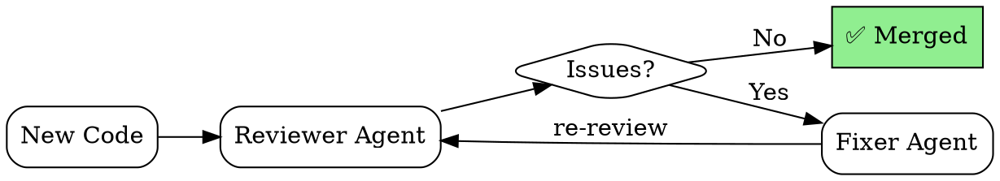

# QA Fix Loop

> Адаптировано из Auto-Claude QA Loop для SENTINEL DevKit

## Философия

Вместо ручного ping-pong между reviewer и developer, создаём автономный цикл:
1. **Reviewer Agent** находит проблемы
2. **Fixer Agent** исправляет их
3. **Re-review** до достижения качества

---

## Архитектура

```
┌─────────────┐     issues     ┌─────────────┐
│  Reviewer   │ ─────────────→ │   Fixer     │
│   Agent     │                │   Agent     │
└─────────────┘                └─────────────┘
       ↑                              │
       │         fixed code           │
       └──────────────────────────────┘
```

---

## Reviewer Agent

### Обязанности
- Проверка spec compliance (Stage 1)
- Проверка code quality (Stage 2)
- Генерация структурированных issues

### Output Format
```json
{
  "status": "NEEDS_FIX | APPROVED",
  "issues": [
    {
      "id": "QA-001",
      "severity": "HIGH | MEDIUM | LOW",
      "file": "path/to/file.py",
      "line": 42,
      "type": "SPEC_VIOLATION | CODE_QUALITY | SECURITY",
      "description": "Что не так",
      "suggestion": "Как исправить"
    }
  ],
  "approved_aspects": ["tests", "documentation"]
}
```

---

## Fixer Agent

### Обязанности
- Получает issues от Reviewer
- Исправляет каждый issue
- Документирует изменения
- Запрашивает re-review

### Process
1. Для каждого issue:
   - Понять root cause
   - Применить минимальное исправление
   - Добавить тест если нужно
2. Собрать все изменения
3. Вернуть на review

---

## Workflow (DOT)



---

## Лимиты и Safety

### Max Iterations
- **Default**: 3 итерации
- **После 3 итераций**: Эскалация к человеку

### Severity Escalation
- **HIGH severity не исправлена**: Немедленная эскалация
- **Security issue**: Блокировка merge + alert

### Infinite Loop Prevention
```python
if iteration > MAX_ITERATIONS:
    escalate_to_human(
        reason="QA loop exceeded max iterations",
        issues=unresolved_issues
    )
```

---

## Интеграция с SENTINEL

### Для Engine QA
```
1. Engine code → Reviewer Agent
2. Reviewer checks:
   - All payloads detected (Strike integration)
   - Interface compliance
   - Performance bounds
3. Issues → Fixer Agent
4. Loop until approved
```

### Для Shield QA
```
1. C code → Reviewer Agent (специализированный)
2. Reviewer checks:
   - Memory safety
   - Protocol compliance
   - Cross-platform compatibility
3. Issues → Fixer Agent
4. Loop until approved
```

---

## Metrics

Трекинг эффективности цикла:
- **Loop count** — среднее число итераций
- **Issue categories** — какие типы проблем чаще
- **Time to fix** — время на исправление
- **Escape rate** — сколько issues пропущено на production

---

## Anti-patterns

❌ **Бесконечный loop** — всегда ставить max iterations
❌ **Fixer игнорирует issues** — проверять что ВСЕ issues адресованы
❌ **Reviewer слишком строгий** — избегать nitpicking на каждой итерации
❌ **Нет эскалации** — человек должен быть в loop для сложных cases
