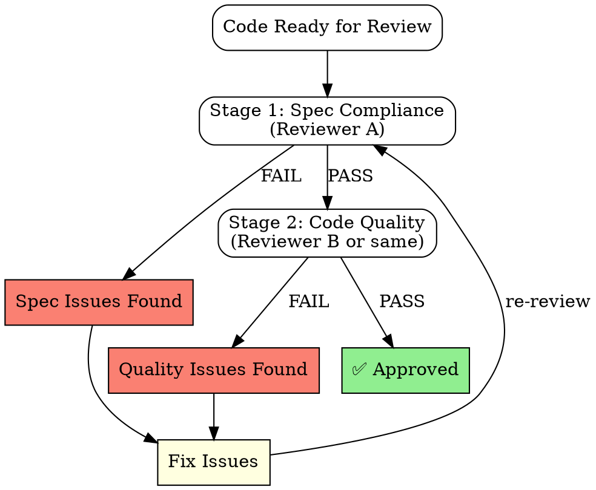

# Two-Stage Code Review

> Адаптировано из Superpowers для SENTINEL DevKit

## Философия

Традиционный code review смешивает две разные задачи:
1. **Соответствие спецификации** — делает ли код то, что нужно?
2. **Качество кода** — хорошо ли написан код?

Смешивание ведёт к пропуску ошибок. Разделяем на два прохода.

---

## Stage 1: Spec Compliance Review

### Фокус
- Реализует ли код ВСЕ требования из спецификации?
- Нет ли пропущенных edge cases?
- Соответствует ли поведение acceptance criteria?

### Checklist
```markdown
- [ ] Все требования из spec покрыты
- [ ] Все acceptance criteria выполнимы
- [ ] Edge cases из spec обработаны
- [ ] Error states соответствуют spec
- [ ] API contracts соблюдены
```

### НЕ проверяем на этом этапе
- Naming conventions
- Code style
- Performance optimizations
- Refactoring opportunities

---

## Stage 2: Code Quality Review

### Фокус
- Читаемость и maintainability
- Соответствие паттернам проекта
- Performance considerations
- Security implications

### Checklist
```markdown
- [ ] Clean Architecture соблюдена
- [ ] Нет code smells (God objects, long methods)
- [ ] Naming понятное и консистентное
- [ ] Error handling корректный
- [ ] Нет security anti-patterns
- [ ] Тесты читаемые и независимые
```

---

## Workflow (DOT)



---

## Когда использовать

| Ситуация | Two-Stage? |
|----------|------------|
| Новый engine | ✅ Да |
| Bugfix | ⚠️ Stage 1 минимальный |
| Refactoring | ⚠️ Stage 2 основной |
| Security-критичный код | ✅ Да + Security Audit |

---

## Интеграция с SENTINEL

### Для Engine Development
1. **Stage 1**: Проверить что engine обрабатывает ВСЕ payloads из spec
2. **Stage 2**: Проверить Clean Architecture, performance, edge cases

### Для Shield Components
1. **Stage 1**: Protocol compliance, API compatibility
2. **Stage 2**: Memory safety, performance, code style

---

## Anti-patterns

❌ **Смешивание стадий** — "код работает, но naming плохой" на Stage 1
❌ **Пропуск Stage 1** — "код красивый, наверное работает"  
❌ **Один reviewer на обе стадии без паузы** — свежий взгляд важен
