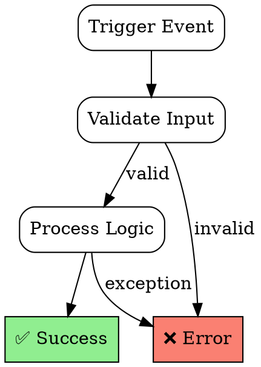
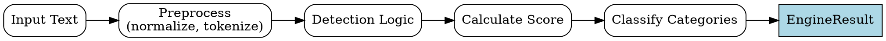
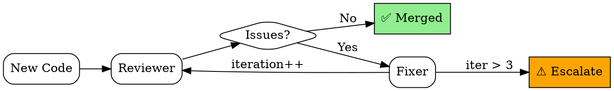
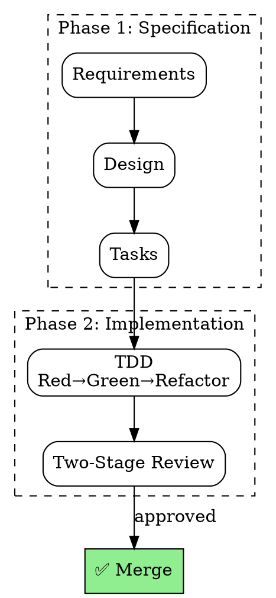

# DOT Flowchart Templates

> Исполняемые спецификации в формате DOT для Kiro design docs

## Назначение

DOT-диаграммы встраиваются в `design.md` как исполняемые спецификации. Они:
1. Визуализируют workflow для человека
2. Служат контрактом для реализации
3. Проверяются на Two-Stage Review

---

## Шаблон: Feature Workflow



---

## Шаблон: Engine Detection Flow



---

## Шаблон: QA Fix Loop



---

## Шаблон: SDD Full Cycle



---

## Использование в Kiro Design

В `design.md` вставлять как:

````markdown
## Workflow Diagram

```dot
digraph my_feature {
    // ... DOT code
}
```
````

Two-Stage Review Stage 1 проверяет что реализация соответствует диаграмме.
