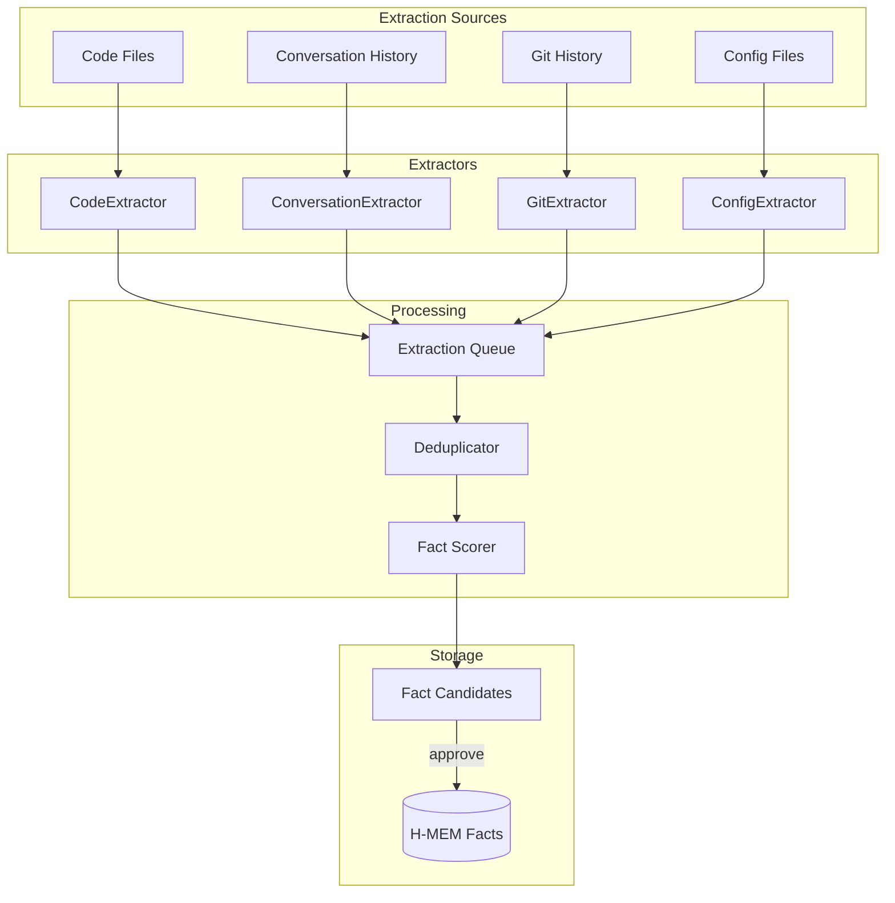

# RLM Auto-Population Enhancement - Дизайн

## Архитектура



---

## Компоненты

### 1. CodeExtractor

**Ответственность:** Извлечение фактов из исходного кода

**Источники:**
- README.md, CONTRIBUTING.md
- Docstrings (Python, TypeScript)
- Комментарии с маркерами: `# DECISION:`, `// TODO:`, `/* ARCHITECTURE:`
- Import statements для dependency graph

**Паттерны для извлечения:**
```python
DECISION_PATTERNS = [
    r"# DECISION:\s*(.+)",
    r"# NOTE:\s*(.+)",
    r"\"\"\"(.+?)\"\"\"",  # docstrings
    r"// ARCH:\s*(.+)",
]
```

**Output:** `FactCandidate` с source="code", confidence=0.7

---

### 2. ConversationExtractor

**Ответственность:** Извлечение решений из диалога агента

**Паттерны:**
- "решил использовать X потому что Y"
- "выбрал подход X для Y"
- "создал/добавил X для Y"
- Коммит-сообщения

**Логика:**
```python
class ConversationExtractor:
    def extract(self, messages: list[Message]) -> list[FactCandidate]:
        candidates = []
        for msg in messages:
            if msg.role == "assistant":
                decisions = self._find_decisions(msg.content)
                for d in decisions:
                    candidates.append(FactCandidate(
                        content=d,
                        source="conversation",
                        confidence=0.6,
                        requires_approval=True
                    ))
        return candidates
```

---

### 3. GitExtractor

**Ответственность:** Извлечение из Git history

**Источники:**
- Conventional commits: `feat(module):`, `fix(module):`, `refactor:`
- PR/MR descriptions
- CHANGELOG.md

**Маппинг на домены:**
```
feat(shield) → domain="shield"
fix(brain) → domain="brain"
```

---

### 4. ConfigExtractor

**Ответственность:** Извлечение из конфигурационных файлов

**Файлы:**
- `package.json` → dependencies, scripts
- `pyproject.toml` → dependencies, metadata
- `Dockerfile` → base image, build steps
- `.env.example` → environment variables

---

## Новые MCP Tools

### `rlm_discover_deep`

```python
@mcp_tool
async def rlm_discover_deep(
    project_root: str = None,
    extractors: list[str] = ["code", "config", "git"],
    auto_approve: bool = False,
    max_facts: int = 100
) -> DiscoveryResult:
    """
    Deep discovery with multiple extractors.
    
    Returns:
        - facts_extracted: int
        - candidates: list[FactCandidate]
        - domains_found: list[str]
    """
```

### `rlm_extract_from_conversation`

```python
@mcp_tool
async def rlm_extract_from_conversation(
    messages: list[dict] = None,
    lookback_count: int = 20
) -> list[FactCandidate]:
    """Extract decisions from recent conversation."""
```

### `rlm_watch_start` / `rlm_watch_stop`

```python
@mcp_tool
async def rlm_watch_start(
    patterns: list[str] = ["**/*.md", "**/*.py"],
    debounce_ms: int = 1000
) -> str:
    """Start file watcher for auto-extraction."""
```

---

## Данные

### FactCandidate (новая структура)

```python
@dataclass
class FactCandidate:
    id: str
    content: str
    source: str  # "code" | "conversation" | "git" | "config"
    confidence: float  # 0.0 - 1.0
    domain: str | None
    level: int  # L0-L3
    requires_approval: bool
    created_at: datetime
    
    # Metadata
    file_path: str | None
    line_number: int | None
    commit_sha: str | None
```

---

## Изменения в существующем коде

| Файл | Изменение |
|------|-----------|
| `src/rlm_mcp_server/tools.py` | Добавить новые tools |
| `src/rlm_mcp_server/extractors/` | Новая папка с extractors |
| `src/rlm_mcp_server/hierarchical.py` | Добавить `add_candidate()` |
| `rlm-vscode-extension/src/` | UI для candidates approval |

---

## Миграция

Обратная совместимость обеспечена:
- Существующие tools не меняются
- Новые tools опциональны
- `rlm_discover_project` остаётся, но помечается как legacy

---

## Вопросы для обсуждения

1. Хранить candidates в отдельной таблице или в той же H-MEM?
2. Нужен ли ML-скорер для confidence или достаточно rule-based?
3. VSCode extension: inline approve или отдельная панель?
